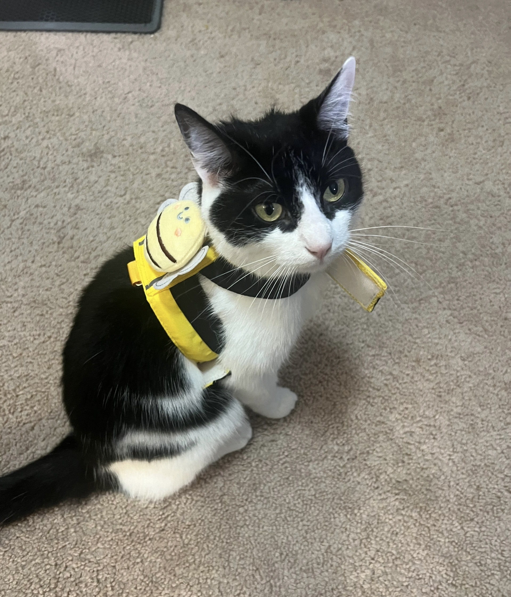

## "From Keys to Strings: A Musical Journey from Childhood to Graduation"

- I began playing the **piano at the age of 4** and achieved the **CMA Piano Performance Certification (Level 10)** by the age of 10.  
- I started learning the **guitar** when I began my **PhD program**, teaching myself through self-study. I can now **sing while playing** and hope to give a **live performance at my graduation**!
  
## "The Tale of Tuna Sun: The Chicken-Loving, Trick-Performing Cat"

- I have a **3-year-old black-and-white cat named Tuna Sun**. Contrary to her name, she doesn't like tuna but absolutely loves chicken.
- Tuna Sun is a smart cat who can **give paws, press buttons, and spin in a circle** on command!
  

## Others
- I am also a **video vlogger and editor** of my **personal channel**, where I create and edit engaging content!
